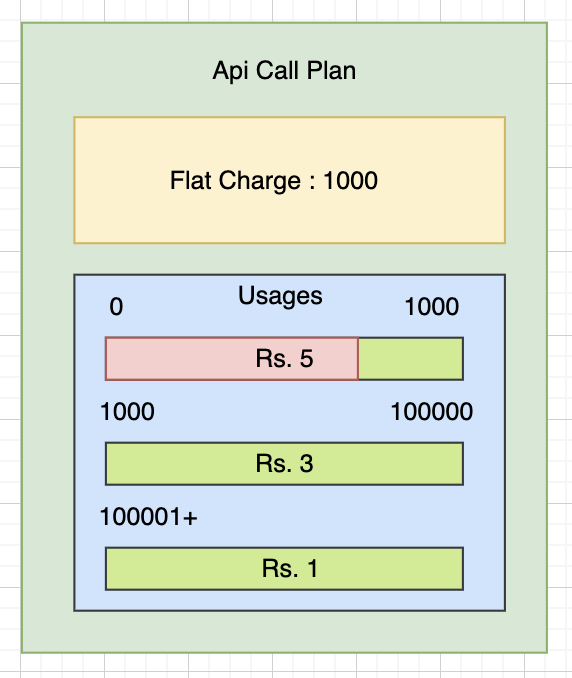
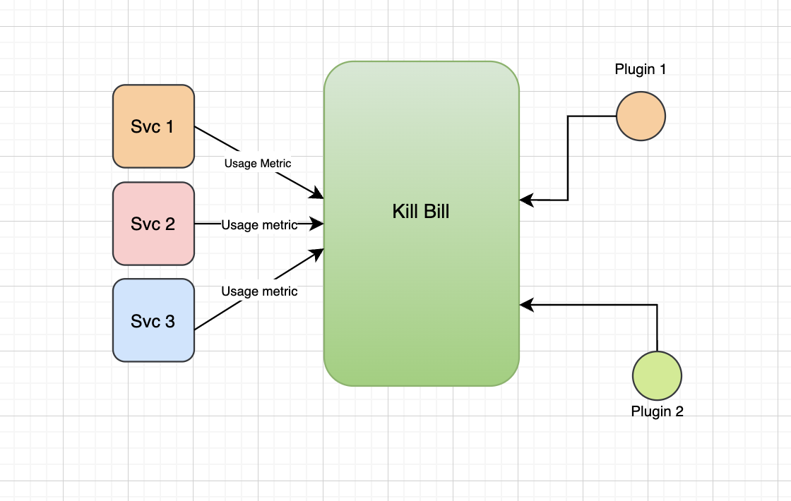
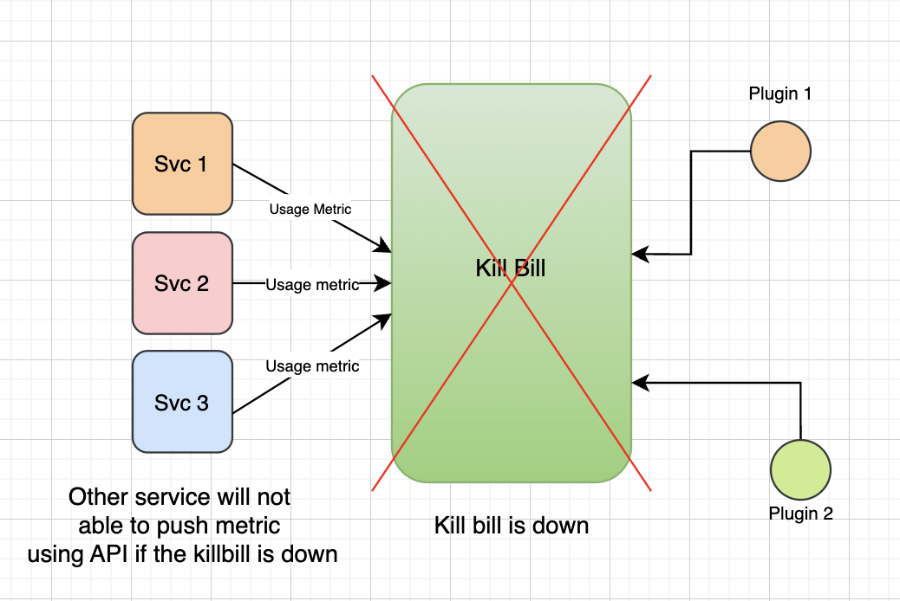
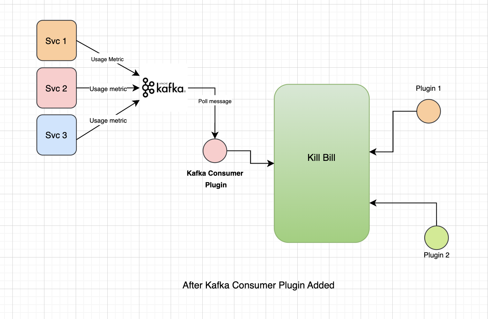
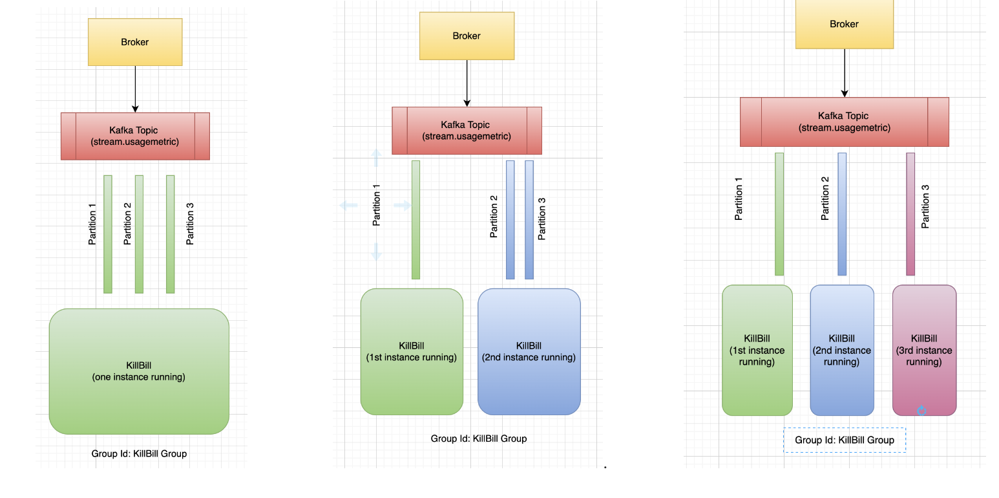

# killbill-kafka-consumer-plugin

This is the OSGI based plugin for [Kill Bill | Open-source billing and payment platform](https://killbill.io/) to provide a support to collect usage through Kafka Stream.

Before going into the deep of the problem statement. I suggest please go through the [killbill.io open source project doc](https://killbill.io/) and there [Gihub code base source](https://github.com/killbill).

## Problem Statement
Consider Kill bill as a black box or a pricingengine which support billing merchants for the businesses. They have there logic to support subscription plan creation, plan versioning, change plan, different billing cycle (DAILY, MONTHLY, ANNUALLY, QUARTERLY, BIANNUALLY, WEEKLY) and many more features like authorization support on the basis of roles and permission.
To know more about this read [what is kill bill](https://docs.killbill.io/latest/what_is_kill_bill)

The main feature that killbill is providing is charging merchant of customers on the basis of events i.e. metering a usage based billing. 
For example charging merchant on the basis of number of API calls. 
Also it provides tear based pricing. For example, I can negotiate with merchant that I will provide three tears for API calls like tier1 of limit 1000 I will charge Rs. 5 for each API call, similar to other two tear I can charge Rs.2 and Rs.1 as shown in the below diagram. To know how much killbill has to charge the merchant.
We have to push usage(event) to the killbill and killbill takes the ownership to increase the usage in the tier as shown with the red color in the diagram and then charge each event and generate invoice for the merchant.





Now to know killbill about the usage of the merchant. Other Service has to push those events by using there record usage for subscription API.
The motivation behind this plugin is to address a specific use case, as illustrated in the architecture diagram below. In the Kill Bill ecosystem, services typically interact with Kill Bill through its API. Each service operates within its own tenant in Kill Bill, with each tenant having its own set of accounts. These accounts are subscribed to plans using unique external keys.
In many scenarios, services need to push account events using the record usage for the subscription API. This involves regular API calls to Kill Bill, as depicted in the diagram.

<div  style="">

</div>


In the event of a production outage in Kill Bill due to external issues such as development changes or failures in external services, there may be a period during which Kill Bill is inaccessible. Although developers can quickly revert changes and restore Kill Bill, there is a gap in service availability during the downtime. This poses a significant challenge, particularly for other services that continue to operate and attempt to push metrics using the API.

<div  style="">

</div>

Each service typically has its own client implementation to interact with Kill Bill, and these implementations may or may not include retry mechanisms. As a result, the inability to access Kill Bill during downtime can lead to operational nightmares for developers and businesses alike. It impacts the overall product services and disrupts business operations.

To address this challenge, we proposed the use of Kafka, where every service can publish its metrics to a Kafka topic. Kill Bill can then consume these messages using the Kafka Consumer Plugin. Even in the event of downtime in Kill Bill, other services can continue to push their usage metrics to the Kafka topic. When Kill Bill resumes operation, it can still consume the messages that were pushed during the downtime. This ensures greater reliability of the service and minimises disruptions to business operations.
<div  style="">

</div>


## What if multiple instance of killbill are running or duplicate message get published and hence consumed ? How this will handled?
To address the query regarding multiple instances running in parallel and connecting to Kafka, let's delve into how consumers interact with Kafka. Each consumer is associated with a group ID, which automatically manages consumption across multiple instances. In the case of our KafkaConsumer Plugin, all instances will share the same group ID.

Now, consider there are three partitions for a topic, each containing its own set of messages. If there's only one instance available, all three partitions will be assigned to a single instance, effectively allowing one consumer to consume from all partitions.
However, if two consumers/instance are present. Since the consumer group id remain same,  one partition will be assigned to one instance, while the other two partitions will be assigned to the second instance. Similarly, if there are three instances, each partition will be assigned to one instance. This distribution process is also known as horizontal scaling.
In the event that multiple instances are in operation, there's no issue because each message resides in only one partition. Even if the same message is inadvertently pushed twice into different partitions and consumed by two different consumers, only one instance will process it since they share the same tracking ID. This ensures that duplicate processing of the same message is effectively prevented




## Getting Started

1. Before starting plugin first setup kafka. [Download Kafka](https://kafka.apache.org/quickstart) on local.
2. Start Zookeeper after cd into apache kafka folder.
```bash
bin/zookeeper-server-start.sh config/zookeeper.properties
```

3. Start Broker Service
```bash
bin/kafka-server-start.sh config/server.properties
```
4. Now kafka is setup. Now you can build the plugin using maven.
```bash
mvn clean install 
```
5. Move the jar file to the plugin folder of the killbill or via using kpm
```bash
kpm install_java_plugin kafka-consumer --from-source-file target/kafka-consumer-plugin-*-SNAPSHOT.jar --destination /var/tmp/bundles
```
6. You also need to configure kafka properties by adding below properties in the `killbill-server.properties`.
```
org.killbill.billing.plugin.kafka.topic.usagemetric=stream.usagemetrics
org.killbill.billing.plugin.kafka.server=localhost:9092
org.killbill.billing.plugin.kafka.consumerGroup=killbillgroup
org.killbill.billing.plugin.kafka.sslEnabled=false
```
7. If there is SSL handshake required you can make `sslEnbled` to `true`. And after provide the truststore and keystore related config as shown below
```
org.killbill.billing.plugin.kafka.topic.usagemetric=stream.usagemetrics
org.killbill.billing.plugin.kafka.server=localhost:9092
org.killbill.billing.plugin.kafka.consumerGroup=killbillgroup
org.killbill.billing.plugin.kafka.sslEnabled=true
org.killbill.billing.plugin.kafka.trustStoreLocation=/Users/prashant.kumar/Downloads/keystore1.jks
org.killbill.billing.plugin.kafka.trustStorePassword=cashfree
org.killbill.billing.plugin.kafka.keyPassword=cashfree
org.killbill.billing.plugin.kafka.keyStoreLocation=/Users/prashant.kumar/Downloads/keystore1.jks
org.killbill.billing.plugin.kafka.keyStorePassword=cashfree
```
8. Now you are ready to push usage message to the killbill using kafka.
   - Create Tenant and Catalog.
   - Create Account and Subscribe the plan using Subscription external key.
   - Now push message using a command or via API that I have added to publish message to the kafka topic and then our kafka consumer will consume the message.
   - Provide `subscriptionExternalKey` you used while creating a subscription and `tenantId` that you have created.
```curl
echo '{"subscriptionExternalKey": "ROUTER_19_mandate-creation-plan-monthly","trackingId": "11","tenantId":"0d96d663-00c1-4ff7-8324-d97cc551d6b3","unitUsageRecords": [{"unitType": "txnCount","usageRecords": [{"recordDate": "2024-05-01T02:59:33.147","amount": 2}]},{"unitType": "txnVolume","usageRecords": [{"recordDate": "2024-05-01T02:59:33.147","amount": 250}]}]}' | bin/kafka-console-producer.sh  --bootstrap-server localhost:9092 --topic stream.usagemetrics
```

```curl
curl --location 'localhost:8080/plugins/kafka-consumer-plugin/?topicName=stream.usagemetrics' \
--header 'Content-Type: application/json' \
--data '{
  "subscriptionExternalKey": "ROUTER_19_mandate-creation-plan-monthly",
  "trackingId": "11",
  "tenantId":"0d96d663-00c1-4ff7-8324-d97cc551d6b3",
  "unitUsageRecords": [
    {
      "unitType": "txnCount",
      "usageRecords": [
        {
          "recordDate": "2024-05-01T02:59:33.147",
          "amount": 2
        }
      ]
    },
    {
      "unitType": "txnVolume",
      "usageRecords": [
        {
          "recordDate": "2024-05-01T02:59:33.147",
          "amount": 250
        }
      ]
    }
  ]
}

'
```
9. You will see logs like:
```
Received message: {"subscriptionExternalKey":"ROUTER_19_mandate-creation-plan-monthly","trackingId":"11","tenantId":"0d96d663-00c1-4ff7-8324-d97cc551d6b3","unitUsageRecords":[{"unitType":"txnCount","usageRecords":[{"recordDate":1714532373147,"amount":2}]},{"unitType":"txnVolume","usageRecords":[{"recordDate":1714532373147,"amount":250}]}]} from partition : 2
```
